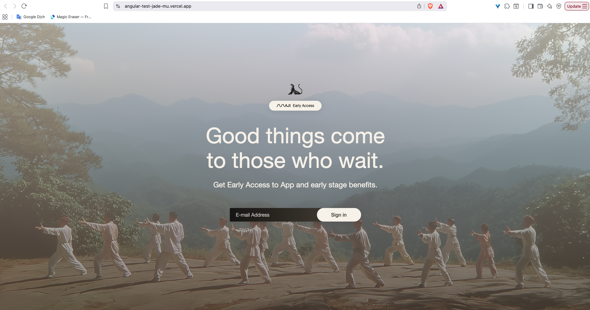

# Angular Test Application

A standalone Angular application with Tailwind CSS for email whitelist validation.

## Features

- Email whitelist validation
- Success state with custom background and toast notification
- Error state with red gradient and error toast
- 404 page for invalid routes

## Whitelist Emails (Assume we will have a whitelist)

The following emails are whitelisted for testing:
- `test@example.com`
- `user@maji.com`
- `admin@maji.com`
- `demo@test.com`

## Installation

```bash
npm install
```

## Deployed URL
[View Live Demo](https://angular-test-jade-mu.vercel.app/)

## Demo Image


## Development (Local)

```bash
npm start
```

Navigate to `http://localhost:4200/`

## Build

```bash
npm run build
```

